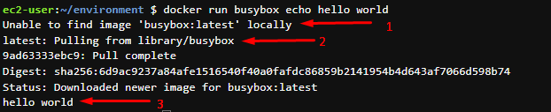
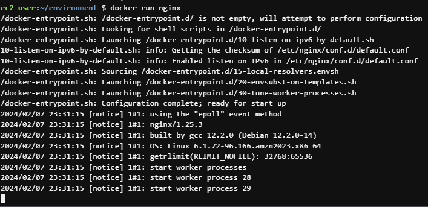
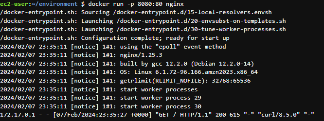
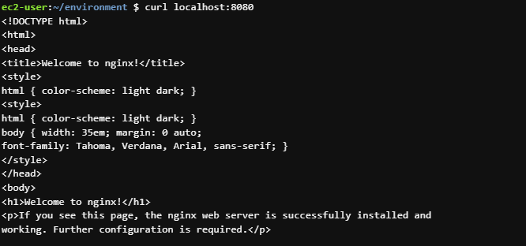
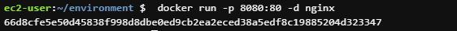

# Trabajando con contenedores

Un contenedor de Docker es un contenedor ejecutable, independiente, ligero que integra todo lo necesario para ejecutar una aplicación, incluidas bibliotecas, herramientas del sistema, código y runtime.

## 1 Principales comandos

#### Hello world en docker
Vamos a ejecutar el clasico "hello world" en docker con el siguiente comando

```sh
$ docker run busybox echo hello world
```

veremos un resultado similar al mostrado en la siguiente imagen

<p align="center">

</p>

A continuacion vamos a explicar cada uno de los sucesos

1 Aqui Docker intenta buscar la imagen busybox en su repositorio local

2 Como no encontro la imagen la empieza a descargar

3 Ejecuta el comando enviado al contenedor "echo hello world"

##### docker container ls

Lista los contenedores

```sh
$ docker container ls [OPTIONS]
```

Los comandos equivalente son los siguientes

```sh
$ docker container list
$ docker container ps
$ docker ps
```

Importante! El comando nos mostrara los contenedores en estado RUNNING, pero si queremos ver todos los contenedores debemos agregar cualquiera de las siguientes banderas

```sh
$ docker ps -a
$ docker ps --all
```

##### docker container run

El comando docker run ejecuta un comando en un nuevo contenedor, descargando la imagen si es necesario y arrancando el contenedor.

```sh
$ docker container run [OPTIONS] IMAGE [COMMAND] [ARG...]
```

El comando equivalente es el siguiente

```sh
$ docker run [OPTIONS] IMAGE [COMMAND] [ARG...]
```

##### docker container run (Ejemplo)

A continuación vamos a correr el servidor nginx paso a paso revisando cada uno de las opciones disponibles junto al comando run para dejar corriendo nuestro servidor.

1 Vamos a arrancar nuestro contenedor nginx

```sh
$ docker run nginx
```

Vamos a ver que nuestro shell se quedara atachado a los logs del contenedor

<p align="center">

</p>
Para detener el contenedor presionamos "ctrl + C"

2 Para obtener una respuesta de nustro servidor vamos a enlazarlo a un puerto, para ello lanzamos el siguiente comando

```sh
$ docker run -p 8080:80 nginx
```

Con la bandera -p asignamos un puerto del host al puerto del contenedor (-p host_port:container_port)

Para realizar una petición http al servidor dentro del contenedor vamos a lanzar el siguiente comando desde una consola diferente a la que se encuentra corriendo el contenedor (también podríamos hacer la petición desde nuestro navegador web)

```sh
$ curl localhost:8080
```

En la siguiente imagen correspondiente a los logs del contenedor, vemos en la ultima linea que el servidor nginx recibió la petición y retorno la respuesta

<p align="center">

</p>

Por otro lado en la pestaña donde hicimos curl, verificamos que la respuesta fue el html de bienvenida de nginx

<p align="center">

</p>

4 Para correr el servidor nginx como demonio y que no se nos quede atachado a la consola vamos a utilizar la bandera "-d" (d por la palabra DETACHED)

```sh
$ docker run -p 8080:80 -d nginx
```

vamos a ver que el contenedor empieza a correr desatachado de la consola

<p align="center">

</p>

5 Para agregar un nombre a nuestro contenedor vamos lanzar el siguiente comando

```sh
$ docker run --name mynginx -p 8081:80 -d nginx
```

##### docker container stop

Envia una señal al contenedor o contenedores para detener su ejecucion

```sh
$ docker container stop [CONTAINER...]
```
El comando equivalente es el siguiente

```sh
$ docker stop [CONTAINER...]
```


##### docker container rm

Elimina uno o más contenedores. Para poder utilizar este comando el contenedor debe estar detenido. No se podra eliminar contenedores en estado RUNNING

```sh
$ docker container rm [CONTAINER...]
```

El comando equivalente es el siguiente

```sh
$ docker container remove [CONTAINER...]
$ docker rm [CONTAINER...]
```

##### docker container exec

El comando docker exec ejecuta un nuevo comando en un contenedor en ejecución.

El comando que especifica con Docker Exec solo se ejecuta mientras se ejecuta el proceso principal del contenedor (PID 1) y no se reinicia si se reinicia el contenedor.

```sh
$ docker container exec CONTAINER COMMAND 
```
El comando equivalente es el siguiente

```sh
$ docker exec CONTAINER COMMAND 
```

Ejemplo:

Normalmente vamos a requerir acceder a un contenedor que se encuentra corriendo para revisar algunos archivos, para esto utilizaresmo el comando exec para ingresar al contenedor usando bash

```sh
$ docker exec -it CONTAINER bash 
```

##### docker container logs

El comando Docker Logs recupera por lotes los registros presentes en el momento de la ejecución.

```sh
$ docker container logs CONTAINER
```
El comando equivalente es el siguiente

```sh
$ docker logs CONTAINER
```

Si deseas ver los logs en tiempo real, debe lanzar el siguiente comando

```sh
$ docker logs --follow CONTAINER
```

##### docker container diff 

Muestra los archivos y directorios modificados en el sistema de archivos de un contenedor desde que se creó el contenedor.

```sh
$ docker container diff CONTAINER
```

El comando equivalente es el siguiente

```sh
$ docker diff CONTAINER
```
Muestra 3 estados
 
- A: Added
- D: Deleted
- C: Changed
