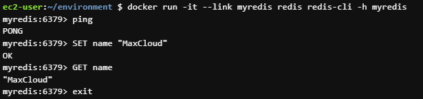

# Enlazando contenedores

Cuando trabajas con contenedores muchas veces vas a querer que exista una comunicación entre estos, para esto se utiliza el comando run mas la bandera --link

#### docker run --link

A continuación se va mostrar un ejemplo del uso de la bandera link para poder enlazar dos contenedores

1 Vamos a lanzar un contenedor corriendo redis

```sh
docker run -d --name myredis redis
```

2 Vamos a lanzar otro contenedor redis pero que utilize el redis-cli para poder contectarse al primero.

```sh
docker run -it --link myredis redis redis-cli -h myredis
```

Para enlazar el segundo contenedor con el primero vamos a utilizar la bandera --link y luego colocar el nombre del primer contenedor "myredis".
Despues de colocar la imagen redis, vamos a colocar el comando "redis-cli -h myredis" donde le decimos al contenedor que utilize el redis-cli y se contecte al host (-h) "myredis"

Una vez iniciado el container vamos a lanzar los comandos mostrados en la imagen para interactuar con redis

<p align="center">

</p>
