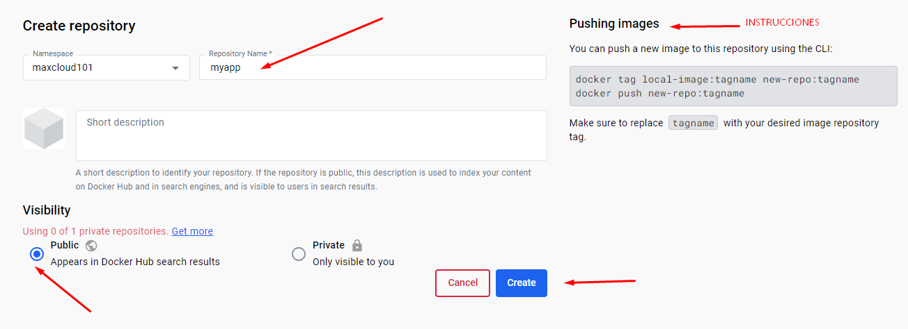
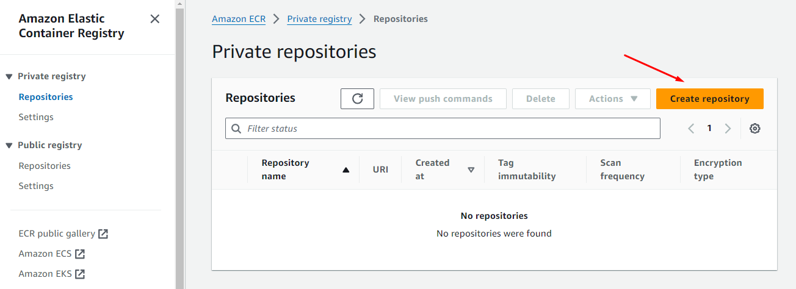
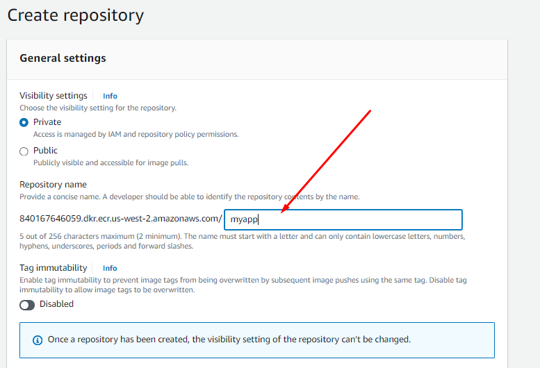
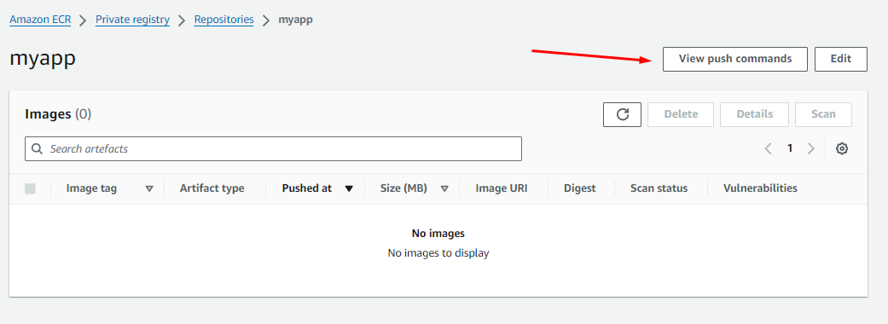
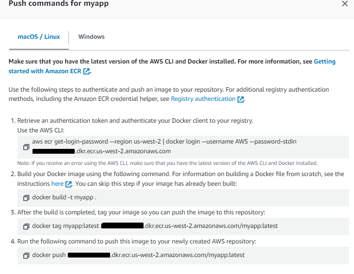
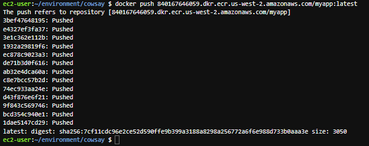

# Llevando nuestro contenedor al registro

## Trabajando con DockerHub

1 Vamos a hacer login en: https://hub.docker.com/

2 Luego vamos a crear un repositorio

<p align="center">

</p>

3 Vamos a colocar el nombre myapp

<p align="center">

</p>

4 Ahora vamos a hacer login desde nuestra maquina donde tenemos el cliente de docker corriendo

```sh
docker login
```
Colocamos nuestro id de dockerhub y nuestra contraseña.

5 Vamos a colocarnos en el proyecto flaskapp y vamos a lanzar el siguiente comando

```sh
docker build -t myapp .
```

Luego tenemos que colocar el nombre del repositorio y la etiqueta correspondiente

```sh
docker tag myapp maxcloud101/myapp:1
```

Finalmente realizamos el push al registro

```sh
 docker push maxcloud101/myapp:1
```

## Trabajando con ECR

1 Vamos al servicio de AWS ECR y vamos a crear un repositorio

<p align="center">

</p>

2 Vamos a colocar el nombre y le damos click en "create"

<p align="center">

</p>

3 Entramos al repositorio y le damos click en "View push commands"

<p align="center">

</p>

4 Vamos a seguir cada una de las instrucciones para subir nuestro contenedor

<p align="center">

</p>

5 Si todo se realizo correctamente, vamos a ver la siguiente pantalla

<p align="center">

</p>
